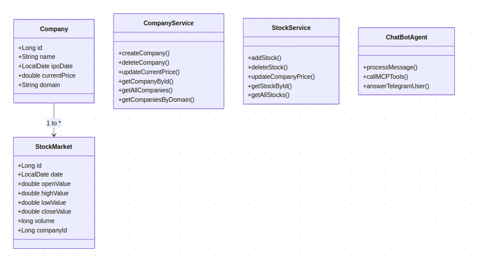
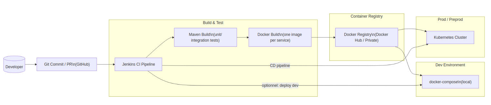

<p align="center">
  
</p>

<h1 align="center">ENSET ADRIA Stock Market</h1>

<p align="center">
  <strong>Modern Stock Market Solutions</strong><br>
  A comprehensive financial management system built with Spring Boot
</p>

<div align="center">
  
  
  
  
  
</div>

---

# Architecture Globale

## 

## 📌 Informations Générales

### Étudiant(e)

- **Nom & Prénom** : Mohammed EL BADRY
- **Filière** : II-BDCC
- **Année Universitaire** : 2025-2026
- **Professeur** : Pr. Mohamed YOUSSFI

---

## 📖 Table des Matières

1. [Introduction](#1-introduction)
2. [Architecture Technique](#2-architecture-technique)
3. [Technologies Utilisées](#3-technologies-utilisées)
4. [Micro-services Développés](#4-micro-services-développés)
5. [Sécurité](#5-sécurité)
6. [Clients (Web & Mobile)](#6-clients)
7. [DevOps & Déploiement](#7-devops)
8. [Tests & Démonstrations](#8-tests)
9. [Difficultés Rencontrées](#9-difficultés)
10. [Conclusion](#10-conclusion)

---

## 1. Introduction

### 1.1 Contexte du Projet

Ce projet consiste à développer un système distribué basé sur une architecture microservices pour la gestion des cotations boursières des entreprises cotées en bourse. Le système permet de gérer les informations des entreprises, leurs cotations, et offre une interface conversationnelle via un chatbot AI.

### 1.2 Objectifs

- Concevoir une architecture microservices robuste
- Implémenter la communication inter-services
- Assurer la sécurité avec OAuth2/OpenID Connect
- Développer des clients Web et Mobile
- Mettre en place un pipeline DevOps

### 1.3 Périmètre Fonctionnel

- Gestion des entreprises cotées en bourse
- Gestion des cotations boursières
- Chatbot AI avec MCP pour Telegram
- Interfaces utilisateur Web et Mobile

## Core Features

- Secure Authentication System with OAuth2
- Customer Management
- Account Operations
- Transaction Processing
- Role-Based Access Control
- RESTful API Documentation with Swagger/OpenAPI

---

**Périmètre fonctionnel**

Company-Service: CRUD Entreprises (id, name, listingDate, currentStockPrice, sector).
Stock-Service: CRUD Cotations (id, date, open/high/low/close, volume, companyId) + mise à jour du prix courant de l’entreprise via la dernière closeValue.
Chatbot-Service: Outils MCP exposant les opérations Company/Stock pour un agent AI.
Services techniques: Discovery (Eureka) et Gateway (Spring Cloud Gateway)

### Points d'accès par service

| Service              | URL                                   | Port | Description                       |
| -------------------- | ------------------------------------- | ---- | --------------------------------- |
| Discovery (Eureka)   | http://localhost:8761                 | 8761 | Tableau de bord Eureka            |
| Gateway              | http://localhost:8888                 | 8888 | API Gateway (routes REST)         |
| Company-Service      | http://localhost:8081/api/companies   | 8081 | API Entreprises (CRUD)            |
| Stock-Service        | http://localhost:8082/api/stocks      | 8082 | API Cotations (CRUD + Feign)      |
| Chatbot-Service      | http://localhost:8090/mcp             | 8090 | API MCP Chatbot (Spring AI)       |
| Keycloak (optionnel) | http://localhost:8080                 | 8080 | Console d'administration Keycloak |
| H2 Console (Company) | http://localhost:8081/h2-console      | 8081 | Console H2 Company-Service        |
| H2 Console (Stock)   | http://localhost:8082/h2-console      | 8082 | Console H2 Stock-Service          |
| API Docs (Company)   | http://localhost:8081/swagger-ui.html | 8081 | Documentation OpenAPI Company     |
| API Docs (Stock)     | http://localhost:8082/swagger-ui.html | 8082 | Documentation OpenAPI Stock       |

---

## Project Structure

### Structure du projet global

```
enset-adria-stock-market-test/
├── discovery-service/      # Eureka Service Discovery
├── gateway-service/        # API Gateway
├── company-service/        # Microservice Entreprises
├── stock-service/          # Microservice Cotations
├── chatbot-service/        # Microservice Chatbot MCP
├── docker-compose.yml      # Orchestration locale
├── k8s/                    # Manifests Kubernetes
├── Jenkinsfile             # Pipeline CI/CD
├── README.md               # Documentation principale
└── REPORT.md               # Rapport détaillé
```

---

### Structure interne d'un microservice (exemple: company-service)

```
src/main/java/ma/enset/companyservice/
├── config/          # Configuration classes
├── dtos/            # Data Transfer Objects
├── entities/        # Domain entities
├── enums/           # Enumeration types
├── exceptions/      # Custom exceptions
├── mappers/         # Object mappers
├── repositories/    # Data access layer
├── security/        # Security configuration
├── services/        # Business logic
└── web/             # REST controllers
```

---

## 3. Technologies Utilisées

### 3.1 Backend

| Technologie          | Version | Usage                  |
| -------------------- | ------- | ---------------------- |
| Spring Boot          | 3.2.x   | Framework principal    |
| Spring Cloud         | 2023.x  | Microservices          |
| Eureka Server        | -       | Service Discovery      |
| Spring Cloud Gateway | -       | API Gateway            |
| OpenFeign            | -       | Client REST            |
| Resilience4J         | -       | Fault Tolerance        |
| Keycloak             | 23.x    | Sécurité OAuth2        |
| H2/MySQL             | -       | Base de données        |
| MCP                  | -       | Model Context Protocol |

### 3.2 Frontend

- **Web** : React 18 / Angular 17
- **Mobile** : Flutter 3.x
- **Chatbot** : Telegram Bot API + MCP

---

## API Documentation

### Company-Service

**Tech Stack:**

- Spring Boot, Spring Data JPA, H2/MySQL, Lombok, SpringDoc OpenAPI, Eureka Client, Feign Client

**Dependencies:**

```xml
<dependency>
    <groupId>org.springframework.boot</groupId>
    <artifactId>spring-boot-starter-web</artifactId>
</dependency>
<dependency>
    <groupId>org.springframework.boot</groupId>
    <artifactId>spring-boot-starter-data-jpa</artifactId>
</dependency>
<dependency>
    <groupId>org.springframework.cloud</groupId>
    <artifactId>spring-cloud-starter-netflix-eureka-client</artifactId>
</dependency>
<dependency>
    <groupId>org.springdoc</groupId>
    <artifactId>springdoc-openapi-starter-webmvc-ui</artifactId>
</dependency>
<dependency>
    <groupId>org.projectlombok</groupId>
    <artifactId>lombok</artifactId>
    <optional>true</optional>
</dependency>
```

**Main Endpoints:**

```http
POST   /api/companies
GET    /api/companies
GET    /api/companies/{id}
PUT    /api/companies/{id}/price?value=DOUBLE
DELETE /api/companies/{id}
GET    /api/companies/sector/{sector}
```

---

### Stock-Service

**Tech Stack:**

- Spring Boot, Spring Data JPA, H2/MySQL, Lombok, SpringDoc OpenAPI, Eureka Client, Feign Client, Resilience4J

**Dependencies:**

```xml
<dependency>
    <groupId>org.springframework.boot</groupId>
    <artifactId>spring-boot-starter-web</artifactId>
</dependency>
<dependency>
    <groupId>org.springframework.boot</groupId>
    <artifactId>spring-boot-starter-data-jpa</artifactId>
</dependency>
<dependency>
    <groupId>org.springframework.cloud</groupId>
    <artifactId>spring-cloud-starter-netflix-eureka-client</artifactId>
</dependency>
<dependency>
    <groupId>org.springframework.cloud</groupId>
    <artifactId>spring-cloud-starter-openfeign</artifactId>
</dependency>
<dependency>
    <groupId>io.github.resilience4j</groupId>
    <artifactId>resilience4j-spring-boot3</artifactId>
</dependency>
<dependency>
    <groupId>org.springdoc</groupId>
    <artifactId>springdoc-openapi-starter-webmvc-ui</artifactId>
</dependency>
<dependency>
    <groupId>org.projectlombok</groupId>
    <artifactId>lombok</artifactId>
    <optional>true</optional>
</dependency>
```

**Main Endpoints:**

```http
POST   /api/stocks
GET    /api/stocks
GET    /api/stocks/{id}
DELETE /api/stocks/{id}
GET    /api/stocks/company/{companyId}
PUT    /api/stocks/company/{companyId}/update-company-price
```

---

### Chatbot-Service (MCP)

**Tech Stack:**

- Spring Boot, Spring AI MCP, Eureka Client, Feign Client

**Dependencies:**

```xml
<dependency>
    <groupId>org.springframework.boot</groupId>
    <artifactId>spring-boot-starter-web</artifactId>
</dependency>
<dependency>
    <groupId>org.springframework.cloud</groupId>
    <artifactId>spring-cloud-starter-netflix-eureka-client</artifactId>
</dependency>
<dependency>
    <groupId>org.springframework.cloud</groupId>
    <artifactId>spring-cloud-starter-openfeign</artifactId>
</dependency>
<dependency>
    <groupId>org.springframework.ai</groupId>
    <artifactId>spring-ai-starter-mcp-server-webmvc</artifactId>
</dependency>
```

**Main Endpoints:**

```http
POST   /mcp/process
GET    /mcp/tools
```

---

### Gateway-Service

**Tech Stack:**

- Spring Boot, Spring Cloud Gateway, Eureka Client, Spring Security (prévu), OpenAPI

**Dependencies:**

```xml
<dependency>
    <groupId>org.springframework.cloud</groupId>
    <artifactId>spring-cloud-starter-gateway</artifactId>
</dependency>
<dependency>
    <groupId>org.springframework.cloud</groupId>
    <artifactId>spring-cloud-starter-netflix-eureka-client</artifactId>
</dependency>
<dependency>
    <groupId>org.springframework.boot</groupId>
    <artifactId>spring-boot-starter-security</artifactId>
</dependency>
<dependency>
    <groupId>org.springdoc</groupId>
    <artifactId>springdoc-openapi-starter-webmvc-ui</artifactId>
</dependency>
```

**Main Flow:**

- Routes REST `/api/companies/**` → Company-Service
- Routes REST `/api/stocks/**` → Stock-Service
- JWT propagation (prévu)

---

### Discovery-Service (Eureka)

**Tech Stack:**

- Spring Boot, Eureka Server

**Dependencies:**

```xml
<dependency>
    <groupId>org.springframework.cloud</groupId>
    <artifactId>spring-cloud-starter-netflix-eureka-server</artifactId>
</dependency>
```

---

### Diagramme de classes



---

## 3. Architecture globale

```text
Clients (Web React / Mobile Flutter / MCP Agent)
          │  REST + JWT
          ▼
   Spring Cloud Gateway (8888) ───────────────┐
          │           ▲                       │
          │  Get Registry                     │
          ▼           │                       │
     Eureka Server (8761) <── Register ── Company-Service (8081)
                                       └─(OpenFeign)
                                         ▲
                                         └────────── Stock-Service (8082)

Keycloak (JWT/OIDC) – prévu pour la sécurité via Gateway (propagation du token)
```

Illustration (schéma): `docs/architecture.png` (placeholder).

---

## 4. Organisation du dépôt

```text
enset-adria-stock-market-test/
├── pom.xml (parent multi-modules)
├── discovery-service/
├── gateway-service/
├── company-service/
├── stock-service/
├── chatbot-service/
├── docker-compose.yml
├── k8s/ (manifests Kubernetes)
├── Jenkinsfile
├── README.md
└── REPORT.md (ce document)
```

---

## 6. Services et API

### 6.1 Discovery-Service (Eureka)

- Code: `discovery-service/src/main/java/.../DiscoveryServiceApplication.java`
- Propriétés: `server.port=8761`, `eureka.client.register-with-eureka=false`, `fetch-registry=false`
- Rôle: Registre de services pour l’auto-découverte.

### 6.2 Gateway-Service

- Code: `gateway-service/src/main/java/.../GatewayServiceApplication.java`
- Config YAML: `gateway-service/src/main/resources/application.yml`
  - Discovery locator activé + routes explicites:
    - `/api/companies/**` → `lb://company-service`
    - `/api/stocks/**` → `lb://stock-service`

### 6.3 Company-Service

- Dossier: `company-service/`
- Entité: `entities/Company.java`
- DTO: `dto/CompanyRequestDTO.java`, `dto/CompanyResponseDTO.java`
- Repository: `repositories/CompanyRepository.java`
- Service: `services/CompanyService.java`, `services/CompanyServiceImpl.java`
- Controller: `web/CompanyRestController.java`
- Seed (dev): `CompanyServiceApplication` → `CommandLineRunner`
- Persistence: H2 (console activée), `spring.jpa.hibernate.ddl-auto=update`

Endpoints REST:

```http
POST   /api/companies
GET    /api/companies
GET    /api/companies/{id}
PUT    /api/companies/{id}/price?value=DOUBLE
DELETE /api/companies/{id}
GET    /api/companies/sector/{sector}
```

Exemple payload (création):

```json
{
  "name": "AdriaTech",
  "listingDate": "2024-05-12",
  "currentStockPrice": 125.5,
  "sector": "IT"
}
```

### 6.4 Stock-Service

- Dossier: `stock-service/`
- Entité: `entities/StockMarket.java`
- DTO: `dto/StockRequestDTO.java`, `dto/StockResponseDTO.java`
- Mapper: `mappers/StockMapper.java`
- Repository: `repositories/StockRepository.java`
  - Inclut `findTopByCompanyIdOrderByDateDesc`
- Feign Client: `clients/CompanyRestClient.java`
- Service: `services/StockService.java`, `services/StockServiceImpl.java`
  - Création d’une cotation → mise à jour du prix courant de l’entreprise avec la `closeValue` de la dernière cotation (via Feign)
  - CircuitBreaker Resilience4J pour robustesse si Company-Service down
- Controller: `web/StockRestController.java`
- Seed (dev): `StockServiceApplication` → `CommandLineRunner`
- Persistence: H2 + JPA

Endpoints REST:

```http
POST   /api/stocks
GET    /api/stocks
GET    /api/stocks/{id}
DELETE /api/stocks/{id}
GET    /api/stocks/company/{companyId}
PUT    /api/stocks/company/{companyId}/update-company-price
```

Exemple payload (création de cotation):

```json
{
  "date": "2025-11-17T10:00:00",
  "openValue": 100.0,
  "highValue": 120.0,
  "lowValue": 95.0,
  "closeValue": 115.0,
  "volume": 5000,
  "companyId": 1
}
```

### 6.5 Chatbot-Service (MCP)

- Dossier: `chatbot-service/`
- Dépendances: Spring AI BOM + `spring-ai-starter-mcp-server-webmvc`, OpenFeign, Eureka client
- Feign Clients: `clients/CompanyClient.java`, `clients/StockClient.java`
- MCP Tools: `tools/McpTools.java`
  - Outils: `get_companies`, `get_company_by_id`, `get_companies_by_sector`,
    `create_company`, `update_company_price`, `get_stocks`, `get_stock_by_id`,
    `get_stocks_by_company`, `create_stock`, `recalculate_company_price`
- Config: `application.properties` (port 8090, Eureka, config off)
- À étendre: intégration Telegram/LLM

---

## 7. Sécurité (prévue)

- Keycloak (realm: `stock-market-realm`)
- Clients: `gateway`, `company-service`, `stock-service` (resource-server)
- Rôles: `USER` (lecture), `ADMIN` (CRUD)
- Flux: Le Gateway valide le JWT et propage l’en-tête Authorization vers les services.
- À implémenter: starters `spring-boot-starter-oauth2-resource-server`, `Issuer URI`,
  `JwtAuthenticationConverter`, filtres Gateway.

---

## 8. DevOps — Architecture et outillage

### 8.1 Architecture DevOps (vue d’ensemble)

```text
Source Repo (GitHub) → CI (Jenkins) → Images Docker → (Compose pour dev) / (K8s pour prod)
                               │
                             Tests
```

### 8.2 Dockerisation

- Dockerfiles présents dans chaque module (Java 17 JRE). Exemple:

```dockerfile
FROM eclipse-temurin:17-jre
WORKDIR /app
ARG JAR_FILE=target/*.jar
COPY ${JAR_FILE} app.jar
EXPOSE 8081
ENTRYPOINT ["sh","-c","java $JAVA_OPTS -jar /app/app.jar"]
```

- `.dockerignore` ajouté pour accélérer les builds.

### 8.3 Docker Compose (local)

Fichier: `docker-compose.yml`

- Services: discovery, gateway, company, stock, chatbot, (optionnel) keycloak
- Réseau: `stock-market-net`
- Variables d’env: `EUREKA_CLIENT_SERVICE_URL_DEFAULTZONE=http://discovery-service:8761/eureka`

Commandes:

```bash
mvn -q -DskipTests clean package
docker compose build
docker compose up -d
```

Accès:

- Eureka: <http://localhost:8761>
- Gateway: <http://localhost:8888>

### 8.4 CI/CD – Jenkins

Fichier: `Jenkinsfile`

- Étapes: Checkout → Maven Build → Build images Docker → (optionnel) Compose Up
- Paramètre: `DEPLOY_DEV=true` pour lancer `docker compose up -d` après build

### 8.5 Kubernetes (optionnel)

Manifests dans `k8s/`:

- `discovery.yaml` (ClusterIP)
- `company.yaml` (ClusterIP)
- `stock.yaml` (ClusterIP)
- `gateway.yaml` (NodePort 30088)
- `chatbot.yaml` (ClusterIP)

Déploiement:

```bash
kubectl apply -f k8s/discovery.yaml
kubectl apply -f k8s/company.yaml
kubectl apply -f k8s/stock.yaml
kubectl apply -f k8s/gateway.yaml
kubectl apply -f k8s/chatbot.yaml
```

Pré-requis: Pousser les images dans un registre accessible au cluster et adapter `image:` si besoin.

Sujets d’amélioration:

- Probes liveness/readiness (Actuator)
- Ingress au lieu de NodePort
- ConfigMaps/Secrets pour Keycloak/DB
- Observabilité: Prometheus/Grafana

---

## 10. Captures & snippets (placeholders)

- Schéma global: `docs/architecture.png`
- Eureka Dashboard: `screenshots/eureka-dashboard.png`
- Gateway routes: `screenshots/gateway-routes.png`
- Tests Postman Company: `screenshots/company-postman.png`
- Tests Postman Stock: `screenshots/stock-postman.png`
- Console H2 Company: `screenshots/company-h2.png`
- CI Jenkins: `screenshots/jenkins-pipeline.png`

Snippets clés (références):

- `company-service/web/CompanyRestController.java`
- `stock-service/web/StockRestController.java`
- `stock-service/services/StockServiceImpl.java` (Feign + CircuitBreaker)
- `chatbot-service/tools/McpTools.java` (exposition MCP tools)

---

## 5. Stack technique

- Java 17, Spring Boot 3.5.x
- Spring Cloud 2025.x: Eureka Server/Client, Spring Cloud Gateway, OpenFeign, LoadBalancer
- JPA + H2 (dev)
- Resilience4J (circuit breaker)
- Keycloak/OAuth2/OIDC/JWT (prévu)
- Spring AI MCP Server WebMVC (chatbot-service)
- Docker, Docker Compose, Jenkins, Kubernetes

---

## 6. Services et API

### 6.1 Discovery-Service (Eureka)

- Code: `discovery-service/src/main/java/.../DiscoveryServiceApplication.java`
- Propriétés: `server.port=8761`, `eureka.client.register-with-eureka=false`, `fetch-registry=false`
- Rôle: Registre de services pour l’auto-découverte.

### 6.2 Gateway-Service

- Code: `gateway-service/src/main/java/.../GatewayServiceApplication.java`
- Config YAML: `gateway-service/src/main/resources/application.yml`
  - Discovery locator activé + routes explicites:
    - `/api/companies/**` → `lb://company-service`
    - `/api/stocks/**` → `lb://stock-service`

### 6.3 Company-Service

- Dossier: `company-service/`
- Entité: `entities/Company.java`
- DTO: `dto/CompanyRequestDTO.java`, `dto/CompanyResponseDTO.java`
- Repository: `repositories/CompanyRepository.java`
- Service: `services/CompanyService.java`, `services/CompanyServiceImpl.java`
- Controller: `web/CompanyRestController.java`
- Seed (dev): `CompanyServiceApplication` → `CommandLineRunner`
- Persistence: H2 (console activée), `spring.jpa.hibernate.ddl-auto=update`

Endpoints REST:

```http
POST   /api/companies
GET    /api/companies
GET    /api/companies/{id}
PUT    /api/companies/{id}/price?value=DOUBLE
DELETE /api/companies/{id}
GET    /api/companies/sector/{sector}
```

Exemple payload (création):

```json
{
  "name": "AdriaTech",
  "listingDate": "2024-05-12",
  "currentStockPrice": 125.5,
  "sector": "IT"
}
```

### 6.4 Stock-Service

- Dossier: `stock-service/`
- Entité: `entities/StockMarket.java`
- DTO: `dto/StockRequestDTO.java`, `dto/StockResponseDTO.java`
- Mapper: `mappers/StockMapper.java`
- Repository: `repositories/StockRepository.java`
  - Inclut `findTopByCompanyIdOrderByDateDesc`
- Feign Client: `clients/CompanyRestClient.java`
- Service: `services/StockService.java`, `services/StockServiceImpl.java`
  - Création d’une cotation → mise à jour du prix courant de l’entreprise avec la `closeValue` de la dernière cotation (via Feign)
  - CircuitBreaker Resilience4J pour robustesse si Company-Service down
- Controller: `web/StockRestController.java`
- Seed (dev): `StockServiceApplication` → `CommandLineRunner`
- Persistence: H2 + JPA

Endpoints REST:

```http
POST   /api/stocks
GET    /api/stocks
GET    /api/stocks/{id}
DELETE /api/stocks/{id}
GET    /api/stocks/company/{companyId}
PUT    /api/stocks/company/{companyId}/update-company-price
```

Exemple payload (création de cotation):

```json
{
  "date": "2025-11-17T10:00:00",
  "openValue": 100.0,
  "highValue": 120.0,
  "lowValue": 95.0,
  "closeValue": 115.0,
  "volume": 5000,
  "companyId": 1
}
```

### 6.5 Chatbot-Service (MCP)

- Dossier: `chatbot-service/`
- Dépendances: Spring AI BOM + `spring-ai-starter-mcp-server-webmvc`, OpenFeign, Eureka client
- Feign Clients: `clients/CompanyClient.java`, `clients/StockClient.java`
- MCP Tools: `tools/McpTools.java`
  - Outils: `get_companies`, `get_company_by_id`, `get_companies_by_sector`,
    `create_company`, `update_company_price`, `get_stocks`, `get_stock_by_id`,
    `get_stocks_by_company`, `create_stock`, `recalculate_company_price`
- Config: `application.properties` (port 8090, Eureka, config off)
- À étendre: intégration Telegram/LLM

---

## 7. Sécurité (prévue)

- Keycloak (realm: `stock-market-realm`)
- Clients: `gateway`, `company-service`, `stock-service` (resource-server)
- Rôles: `USER` (lecture), `ADMIN` (CRUD)
- Flux: Le Gateway valide le JWT et propage l’en-tête Authorization vers les services.
- À implémenter: starters `spring-boot-starter-oauth2-resource-server`, `Issuer URI`,
  `JwtAuthenticationConverter`, filtres Gateway.

---

## 8. DevOps — Architecture et outillage



### 8.1 Architecture DevOps (vue d’ensemble)

Cette vue montre le cycle complet: code → CI Jenkins → images Docker → exécution via Docker Compose ou Kubernetes.

### 8.2 Dockerisation

- Dockerfiles présents dans chaque module (Java 17 JRE). Exemple:

```dockerfile
FROM eclipse-temurin:17-jre
WORKDIR /app
ARG JAR_FILE=target/*.jar
COPY ${JAR_FILE} app.jar
EXPOSE 8081
ENTRYPOINT ["sh","-c","java $JAVA_OPTS -jar /app/app.jar"]
```

- `.dockerignore` ajouté pour accélérer les builds.

### 8.3 Docker Compose (local)

Fichier: `docker-compose.yml`

- Services: discovery, gateway, company, stock, chatbot, (optionnel) keycloak
- Réseau: `stock-market-net`
- Variables d’env: `EUREKA_CLIENT_SERVICE_URL_DEFAULTZONE=http://discovery-service:8761/eureka`

Commandes:

```bash
mvn -q -DskipTests clean package
docker compose build
docker compose up -d
```

Accès:

- Eureka: <http://localhost:8761>
- Gateway: <http://localhost:8888>

### 8.4 CI/CD – Jenkins

Fichier: `Jenkinsfile`

- Étapes: Checkout → Maven Build → Build images Docker → (optionnel) Compose Up
- Paramètre: `DEPLOY_DEV=true` pour lancer `docker compose up -d` après build

### 8.5 Kubernetes (optionnel)

Manifests dans `k8s/`:

- `discovery.yaml` (ClusterIP)
- `company.yaml` (ClusterIP)
- `stock.yaml` (ClusterIP)
- `gateway.yaml` (NodePort 30088)
- `chatbot.yaml` (ClusterIP)

Déploiement:

```bash
kubectl apply -f k8s/discovery.yaml
kubectl apply -f k8s/company.yaml
kubectl apply -f k8s/stock.yaml
kubectl apply -f k8s/gateway.yaml
kubectl apply -f k8s/chatbot.yaml
```
