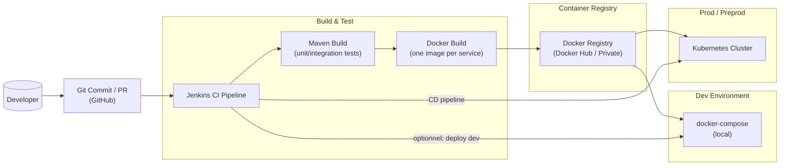

# Rapport de Projet — Système de Gestion des Cotations Boursières (Microservices Spring Cloud)

Ce document présente la conception, l’implémentation et le déploiement d’un système distribué de gestion d’entreprises et de leurs cotations boursières, basé sur Spring Cloud. Il constitue un support d’entretien technique et un rapport de synthèse.

---

## 1. Contexte et objectifs

- Contexte: Architecture microservices Spring Cloud pour gérer des entreprises cotées et leurs cotations.
- Objectifs:
  - Architecture robuste et évolutive: Discovery, Gateway, services métiers, tolérance aux pannes.
  - Communication inter-services (OpenFeign) avec résilience (Resilience4J).
  - APIs REST + outils MCP pour un agent AI/chatbot.
  - Infrastructure DevOps (Docker, Compose, Jenkins, Kubernetes) et sécurité (Keycloak/OIDC/JWT) prévue.

---

## 2. Périmètre fonctionnel

- Company-Service: CRUD Entreprises (id, name, listingDate, currentStockPrice, sector).
- Stock-Service: CRUD Cotations (id, date, open/high/low/close, volume, companyId) + mise à jour du prix courant de l’entreprise via la dernière closeValue.
- Chatbot-Service: Outils MCP exposant les opérations Company/Stock pour un agent AI.
- Services techniques: Discovery (Eureka) et Gateway (Spring Cloud Gateway).

---

## 3. Architecture globale

```mermaid
flowchart LR
  subgraph Clients
    W["Web UI (React/Angular)"]
    M["Mobile App (Flutter)"]
    C["Chatbot / MCP Client"]
  end

  subgraph Edge[API Gateway]
    G["Spring Cloud Gateway\n(port 8888)"]
  end

  subgraph Discovery[Service Discovery]
    E["Eureka Server\n(port 8761)"]
  end

  subgraph Biz[Business Microservices]
    CS["company-service\n(port 8081)"]
    SS["stock-service\n(port 8082)"]
    CHS["chatbot-service\n(port 8090)"]
  end

  subgraph Security[Identity Provider]
    K["Keycloak (OIDC/JWT)"]
  end

  W -->|REST + JWT| G
  M -->|REST + JWT| G
  C -->|MCP HTTP| CHS

  G -->|Service Discovery| E
  CS -->|Register| E
  SS -->|Register| E
  CHS -->|Register| E

  G -->|/api/companies/**| CS
  G -->|/api/stocks/**| SS

  SS -->|OpenFeign + CB| CS

  G -->|JWT Validation| K
  CS -->|Resource Server (prévu)| K
  SS -->|Resource Server (prévu)| K
  CHS -->|Resource Server (optionnel)| K
```

Illustration (rendu Mermaid): architecture globale microservices + sécurité.

---

## 4. Organisation du dépôt

```text
enset-adria-stock-market-test/
├── pom.xml (parent multi-modules)
├── discovery-service/
├── gateway-service/
├── company-service/
├── stock-service/
├── chatbot-service/
├── docker-compose.yml
├── k8s/ (manifests Kubernetes)
├── Jenkinsfile
├── README.md
└── REPORT.md (ce document)
```

---

## 5. Stack technique

- Java 17, Spring Boot 3.5.x
- Spring Cloud 2025.x: Eureka Server/Client, Spring Cloud Gateway, OpenFeign, LoadBalancer
- JPA + H2 (dev)
- Resilience4J (circuit breaker)
- Keycloak/OAuth2/OIDC/JWT (prévu)
- Spring AI MCP Server WebMVC (chatbot-service)
- Docker, Docker Compose, Jenkins, Kubernetes

---

## 6. Services et API

### 6.1 Discovery-Service (Eureka)

- Code: `discovery-service/src/main/java/.../DiscoveryServiceApplication.java`
- Propriétés: `server.port=8761`, `eureka.client.register-with-eureka=false`, `fetch-registry=false`
- Rôle: Registre de services pour l’auto-découverte.

### 6.2 Gateway-Service

- Code: `gateway-service/src/main/java/.../GatewayServiceApplication.java`
- Config YAML: `gateway-service/src/main/resources/application.yml`
  - Discovery locator activé + routes explicites:
    - `/api/companies/**` → `lb://company-service`
    - `/api/stocks/**` → `lb://stock-service`

### 6.3 Company-Service

- Dossier: `company-service/`
- Entité: `entities/Company.java`
- DTO: `dto/CompanyRequestDTO.java`, `dto/CompanyResponseDTO.java`
- Repository: `repositories/CompanyRepository.java`
- Service: `services/CompanyService.java`, `services/CompanyServiceImpl.java`
- Controller: `web/CompanyRestController.java`
- Seed (dev): `CompanyServiceApplication` → `CommandLineRunner`
- Persistence: H2 (console activée), `spring.jpa.hibernate.ddl-auto=update`

Endpoints REST:

```http
POST   /api/companies
GET    /api/companies
GET    /api/companies/{id}
PUT    /api/companies/{id}/price?value=DOUBLE
DELETE /api/companies/{id}
GET    /api/companies/sector/{sector}
```

Exemple payload (création):

```json
{
  "name": "AdriaTech",
  "listingDate": "2024-05-12",
  "currentStockPrice": 125.5,
  "sector": "IT"
}
```

### 6.4 Stock-Service

- Dossier: `stock-service/`
- Entité: `entities/StockMarket.java`
- DTO: `dto/StockRequestDTO.java`, `dto/StockResponseDTO.java`
- Mapper: `mappers/StockMapper.java`
- Repository: `repositories/StockRepository.java`
  - Inclut `findTopByCompanyIdOrderByDateDesc`
- Feign Client: `clients/CompanyRestClient.java`
- Service: `services/StockService.java`, `services/StockServiceImpl.java`
  - Création d’une cotation → mise à jour du prix courant de l’entreprise avec la `closeValue` de la dernière cotation (via Feign)
  - CircuitBreaker Resilience4J pour robustesse si Company-Service down
- Controller: `web/StockRestController.java`
- Seed (dev): `StockServiceApplication` → `CommandLineRunner`
- Persistence: H2 + JPA

Endpoints REST:

```http
POST   /api/stocks
GET    /api/stocks
GET    /api/stocks/{id}
DELETE /api/stocks/{id}
GET    /api/stocks/company/{companyId}
PUT    /api/stocks/company/{companyId}/update-company-price
```

Exemple payload (création de cotation):

```json
{
  "date": "2025-11-17T10:00:00",
  "openValue": 100.0,
  "highValue": 120.0,
  "lowValue": 95.0,
  "closeValue": 115.0,
  "volume": 5000,
  "companyId": 1
}
```

### 6.5 Chatbot-Service (MCP)

- Dossier: `chatbot-service/`
- Dépendances: Spring AI BOM + `spring-ai-starter-mcp-server-webmvc`, OpenFeign, Eureka client
- Feign Clients: `clients/CompanyClient.java`, `clients/StockClient.java`
- MCP Tools: `tools/McpTools.java`
  - Outils: `get_companies`, `get_company_by_id`, `get_companies_by_sector`,
    `create_company`, `update_company_price`, `get_stocks`, `get_stock_by_id`,
    `get_stocks_by_company`, `create_stock`, `recalculate_company_price`
- Config: `application.properties` (port 8090, Eureka, config off)
- À étendre: intégration Telegram/LLM

---

## 7. Sécurité (prévue)

- Keycloak (realm: `stock-market-realm`)
- Clients: `gateway`, `company-service`, `stock-service` (resource-server)
- Rôles: `USER` (lecture), `ADMIN` (CRUD)
- Flux: Le Gateway valide le JWT et propage l’en-tête Authorization vers les services.
- À implémenter: starters `spring-boot-starter-oauth2-resource-server`, `Issuer URI`,
  `JwtAuthenticationConverter`, filtres Gateway.

---

## 8. DevOps — Architecture et outillage

### 8.1 Architecture DevOps (vue d’ensemble)



Cette vue montre le cycle complet: code → CI Jenkins → images Docker → exécution via Docker Compose ou Kubernetes.

### 8.2 Dockerisation

- Dockerfiles présents dans chaque module (Java 17 JRE). Exemple:

```dockerfile
FROM eclipse-temurin:17-jre
WORKDIR /app
ARG JAR_FILE=target/*.jar
COPY ${JAR_FILE} app.jar
EXPOSE 8081
ENTRYPOINT ["sh","-c","java $JAVA_OPTS -jar /app/app.jar"]
```

- `.dockerignore` ajouté pour accélérer les builds.

### 8.3 Docker Compose (local)

Fichier: `docker-compose.yml`

- Services: discovery, gateway, company, stock, chatbot, (optionnel) keycloak
- Réseau: `stock-market-net`
- Variables d’env: `EUREKA_CLIENT_SERVICE_URL_DEFAULTZONE=http://discovery-service:8761/eureka`

Commandes:

```bash
mvn -q -DskipTests clean package
docker compose build
docker compose up -d
```

Accès:

- Eureka: <http://localhost:8761>
- Gateway: <http://localhost:8888>

### 8.4 CI/CD – Jenkins

Fichier: `Jenkinsfile`

- Étapes: Checkout → Maven Build → Build images Docker → (optionnel) Compose Up
- Paramètre: `DEPLOY_DEV=true` pour lancer `docker compose up -d` après build

### 8.5 Kubernetes (optionnel)

Manifests dans `k8s/`:

- `discovery.yaml` (ClusterIP)
- `company.yaml` (ClusterIP)
- `stock.yaml` (ClusterIP)
- `gateway.yaml` (NodePort 30088)
- `chatbot.yaml` (ClusterIP)

Déploiement:

```bash
kubectl apply -f k8s/discovery.yaml
kubectl apply -f k8s/company.yaml
kubectl apply -f k8s/stock.yaml
kubectl apply -f k8s/gateway.yaml
kubectl apply -f k8s/chatbot.yaml
```

Pré-requis: Pousser les images dans un registre accessible au cluster et adapter `image:` si besoin.

Sujets d’amélioration:

- Probes liveness/readiness (Actuator)
- Ingress au lieu de NodePort
- ConfigMaps/Secrets pour Keycloak/DB
- Observabilité: Prometheus/Grafana

---

## 9. Démonstrations (exemples via Gateway)

Lister les entreprises:

```bash
curl -s http://localhost:8888/api/companies
```

Créer une entreprise:

```bash
curl -s -X POST http://localhost:8888/api/companies \
  -H 'Content-Type: application/json' \
  -d '{"name":"TestCorp","listingDate":"2024-01-10","currentStockPrice":99.5,"sector":"IT"}'
```

Créer une cotation et mettre à jour le prix courant:

```bash
curl -s -X POST http://localhost:8888/api/stocks \
  -H 'Content-Type: application/json' \
  -d '{"date":"2025-11-17T12:30:00","openValue":120,"highValue":130,"lowValue":118,"closeValue":127,"volume":7000,"companyId":1}'

curl -s -X PUT http://localhost:8888/api/stocks/company/1/update-company-price
```

---

## 10. Captures & snippets (placeholders)

- Schéma global: `docs/architecture.png`
- Eureka Dashboard: `screenshots/eureka-dashboard.png`
- Gateway routes: `screenshots/gateway-routes.png`
- Tests Postman Company: `screenshots/company-postman.png`
- Tests Postman Stock: `screenshots/stock-postman.png`
- Console H2 Company: `screenshots/company-h2.png`
- CI Jenkins: `screenshots/jenkins-pipeline.png`

Snippets clés (références):

- `company-service/web/CompanyRestController.java`
- `stock-service/web/StockRestController.java`
- `stock-service/services/StockServiceImpl.java` (Feign + CircuitBreaker)
- `chatbot-service/tools/McpTools.java` (exposition MCP tools)

---

## 11. Bilan et pistes futures

- Réalisé: Architecture microservices, Discovery, Gateway, Company, Stock (Feign + Resilience4J), Chatbot MCP, Docker/Compose, Jenkins, manifests K8s.
- À finaliser: Sécurité Keycloak/JWT, Frontend React/Angular, Mobile Flutter, Monitoring et traces, Ingress K8s, tests complets (unitaires/intégration/end-to-end).

---

## 12. Annexes

- Versions:
  - Java 17, Spring Boot 3.5.x, Spring Cloud 2025.x
  - Keycloak 23.x (optionnel)
- Rappels: Seeds (Company/Stock) activés pour dev (H2). En prod: DB (MySQL/PostgreSQL), migrations (Flyway/Liquibase), données initiales contrôlées.
